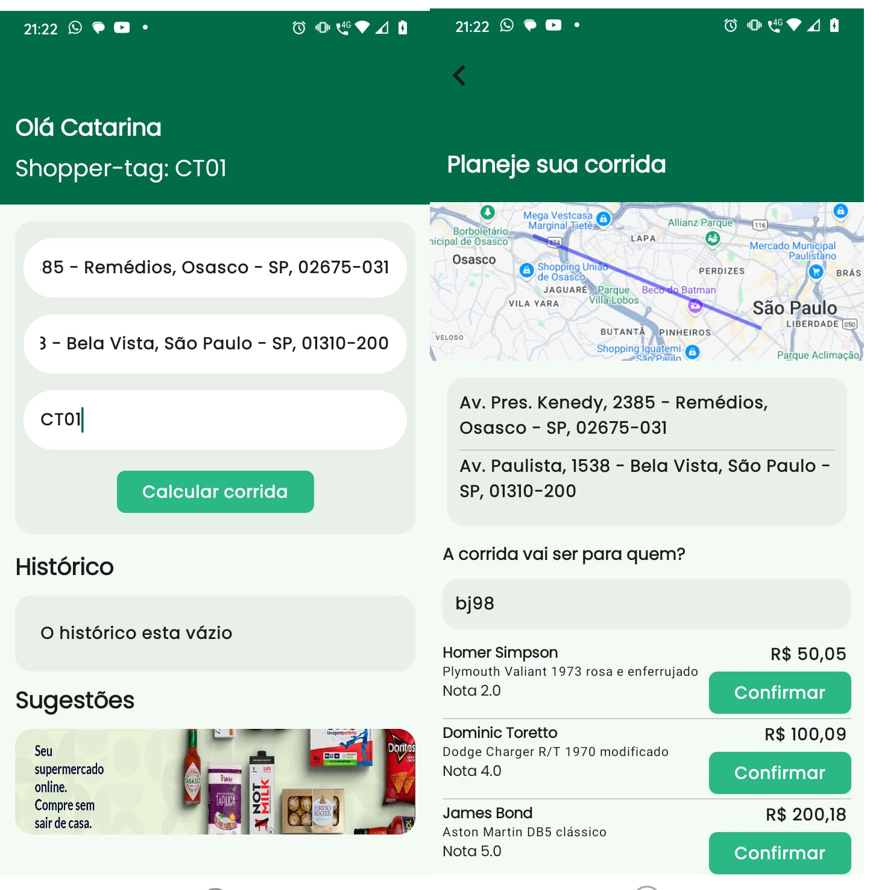

# Shopper Drive - Task Shopper: Desenvolvedor Android

Este app foi escrito em Kotlin, seguindo as diretrizes do Material Design 3, usando a biblioteca de persistência de dados Room para armazenar os dados dos voos e Gson para converter a resposta json em objetos.

### Principais componentes:

* Android Jetpack Components (ViewModel, Kotlin coroutines, Flow, Navigation)
* Jetpack Compose
* Software architecture - MVVM 
* App modularization
* Dependency injection - Koin
 
## Arquitetura

O app segue as recomendações estabelecidas no Guia de arquitetura de aplicativos, sendo divido em módulos:

Essa estratégia permite que o código seja isolado e mais fácil de ler, entender, testar e manter. Além do padrão MVVM  que é utilizado para separar a lógica de apresentação da lógica de negócios.
  
## Overview

O ShopperDrive é uma aplicação projetada para facilitar o planejamento e o gerenciamento de corridas. Com uma interface intuitiva, os usuários podem facilmente configurar sua origem, destino e calcular estimativas de viagens. 

Planejamento de Corridas:
Insira a origem, destino e um identificador.
Visualize a rota traçada no mapa.
Escolha o motorista desejado a partir de opções sugeridas, com informações detalhadas como nome, modelo do carro, e valor estimado.

## Integração com Retrofit e OkHttp

O ShopperDrive utiliza as bibliotecas Retrofit e OkHttp para comunicação com APIs REST, permitindo a integração com serviços externos de forma eficiente e segura.

Definição de Endpoints: O Retrofit é usado para criar interfaces de serviço que definem as requisições HTTP (como GET, POST, etc.).
Conversão Automática: Com suporte a Gson, os dados recebidos do servidor são automaticamente convertidos em objetos Kotlin, facilitando o uso dentro do app.
Implementação de Casos de Uso: Os casos de uso, como GetRideUseCase e EstimateTripValueUseCase, utilizam os serviços do Retrofit para fazer chamadas à API e processar os dados retornados.

## Observação do desenvolvedor
Obrigado a toda a equipe do Shopper por proporcionar essa oportunidade!
